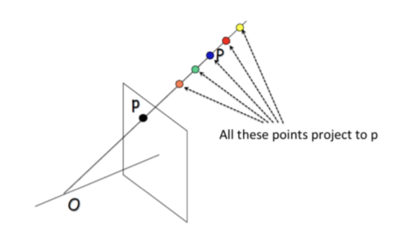

# Depth Estimation in Images using Stereo
-------
### Objective
Using a single camera it is not possible to estimate the distance of point P from the camera located at point O. All of the points in the projective line that P belongs to will map to the same points p in the image. Therefore, making it impossible to estimate the distance.

However there is a solution to this problem, a stereo camera system can be used. Here we explore how we can use a parallel camera system to estimate depth of objects in an image from scratch, without using any libraries.

Data Source => https://vision.middlebury.edu/stereo/data/scenes2014/
