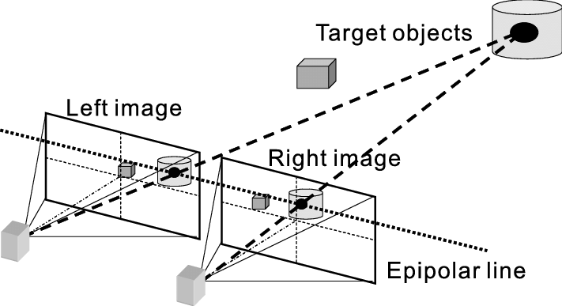

# Depth Estimation in Images using Stereo
--------
### Objective
Using a single camera it is not possible to estimate the distance of point P from the camera located at point O. All of the points in the projective line that P belongs to will map to the same points p in the image. Therefore, making it impossible to estimate the distance.

  
   
  Figure 1

However there is a solution to this problem, a stereo camera system can be used. Here we explore how we can use a parallel camera system to estimate depth of objects in an image from scratch, without using any libraries.

  
   
  Figure 2

### Data Source 
We will be using the Middlebury database. It provides calibrated images taken from parallel cameras.

=> https://vision.middlebury.edu/stereo/data/scenes2014/

### Depth Calculation

- Re-sizing stereo images to be of the same size (500, w). Here we used the cv2.resize() function to perform this action. This also helped in faster processing as originally the images were around (2000, 2000). Function ⇒ resizeImage().
- Once we have the stereo images of the same size, for each window patch in the left image, its correspondence location in the right image is retrieved by using normalized cross-correlation over the epipolar line. Functions ⇒ get_disparity_parallel(), compute_row() and norm_cross_correlation().
- Then, the disparity is calculated for the correspondence locations. Here, the get_disparity_parallel() calls the compute_row() that fetches the window patches from the left image one by one and passes it to the norm_cross_correlation().
- Then, the norm_cross_correlation() returns the output correlated map over the epipolar line back to compute_row() and compute_row() calculates the correspondence location. Once we have the correspondence location, the compute_row() calculates the disparity. Functions ⇒ get_disparity_parallel(), compute_row() and norm_cross_correlation().
- After having the disparity map, the depth of pixels is calculated using equation (2). Function ⇒ get_depth()
- Here, some pixels would have the depth of infinity as their disparity was zero, and for visualization purposes, this infinity value is handled by the function replace_inf().

### Results

  
  
  
   
  Output Img 1

  
  
  
   
  Output Img 2

### Observations

- Depth of pixels are easier to interpret with colormaps as compared to the Grayscale images.
- Results are much better when the window size is 5x5, this is because the smaller window is able to capture much more variations in the images.
- However, the smaller window size brings in a lot of noise in the resulting image.
- cmap Prism represents the portions of the image in red which are closer to the viewer and in blue which are away from the viewer.
- cmap Flag represents the portions of the image in dark blue which are closer to the viewer and in white and red which are away from the viewer.
- The depth map is heavily affected by shadows in the input image. In the original image above, there is only one wall in the background, however the depth shows it as two walls.
- Disparities are more accurate when there are different textures inside a window.

### Strenght & Weaknesses

#### Strengths:
- Works on both 2D and 3D images without specifying anything.
- Good visual results for depth of pixels.
- The parallel computation implemented significantly speeds up the execution.

#### Weaknesses:
- Only for parallel translated captured images.
- No camera calibration therefore there might be bit poor results.
- Even though we calculated disparity in parallel, it still takes some time to perform the calculations.

